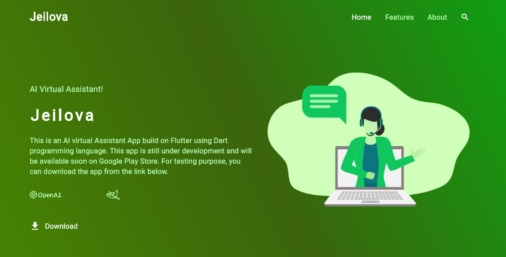

###### 
# jeilova-landing-page 
A cross platform virtual assistant application built on flutter with open AI

<h1 align="center"></h1>
This is an AI virtual Assistant App build on Flutter using Dart programming language. This app is still under development and will be available soon on Google Play Store. For testing purpose, you can download the app from the link below.
## Download Below 
- [Android jeilova App](https://drive.google.com/file/d/1DrrITkEOgG0L4Fh8rHmKnqqqlPbdiRVK/view?usp=sharing)

## Features

- Open AI : - A smarter way to be stay informed and organized with AI. Using ChatGPT in a more creative easy to access way. 

- AI Image Generator with Dall-E :  - Get creative and stay inspired with your personal image generation assistant powered by AI.

- Smart Voice Assistant : - Get the best of both worlds with a voice assistant powered by AI using flutter tts.

###### 

####
<!-- Features demo Video -->
<figure class="video_container">
  <iframe src="https://github-production-user-asset-6210df.s3.amazonaws.com/44504553/245128326-bfdbbfde-c48d-4fb0-acf9-9a804f69f39f.mp4" frameborder="0" allowfullscreen="true"> </iframe>
</figure>
<!-- Features demo Video -->

## About    :: 
This is the My ALX SE Foundations Project to mark my moving on from the [ALX](https://www.alxafrica.com/) / [Holberton School](https://www.holbertonschool.com/) Full-Stack Software Engineering Foundations Program into the Specialization phase.

###### 
### Team    ######  

### Author    ###### 
* *Kolade Fatai Opeyemi* 

 
      
      
      
      
      
      

 

